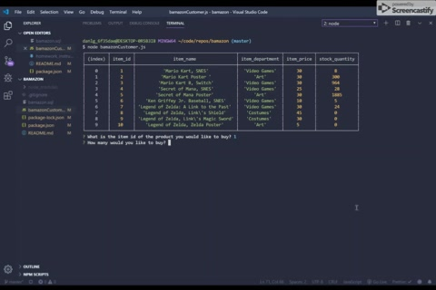

# Bamazon

## Description: 
Want to skip the lines and get deliveries to your door?  Wait, and you don't have to patronize that megacorporation with the smile?  Your answer is Bamazon, the streamlined storefront with no recommendations being thrown in your face!  Bamazon is a command line node app that will provide users the ability to select an item from the database and purchase a specified quantity, then update the reflected quantity.

---

## Technologies used:
  - Node.js
  - Javascript
  - MySQL
  

## NPM packages:
  - "inquirer": "^7.0.0",
  - "mysql": "^2.17.1"
  - "delay": "^4.3.0",

## Commands:
  User will be prompted to type in the id number of the item wanting to be purhcased, then the quantity. The purchase will then be reflected in the database, as the stock quantity will be deducted by the amount purchased. If  user attempts to purhcase an amount that is larger the the stock quantity,  user will see "Insufficient Stock" displayed.  User 

`Author:
  
 //Dan L. Grigg`
